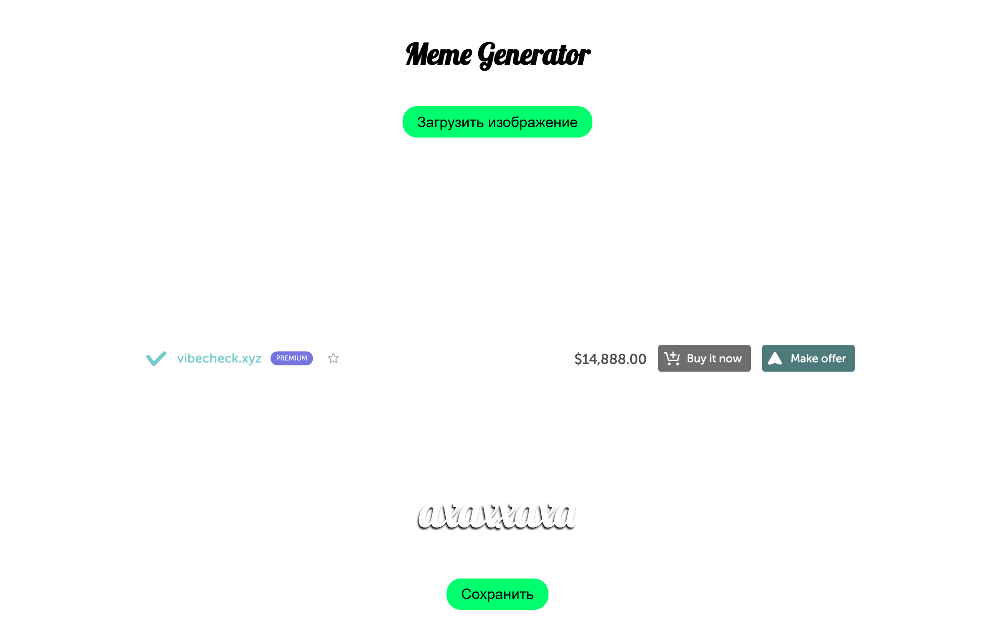
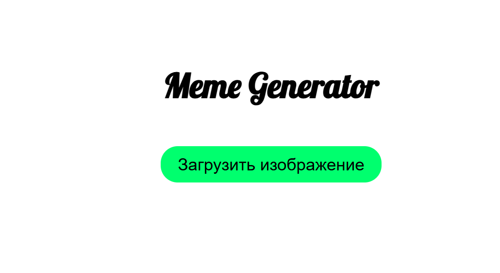
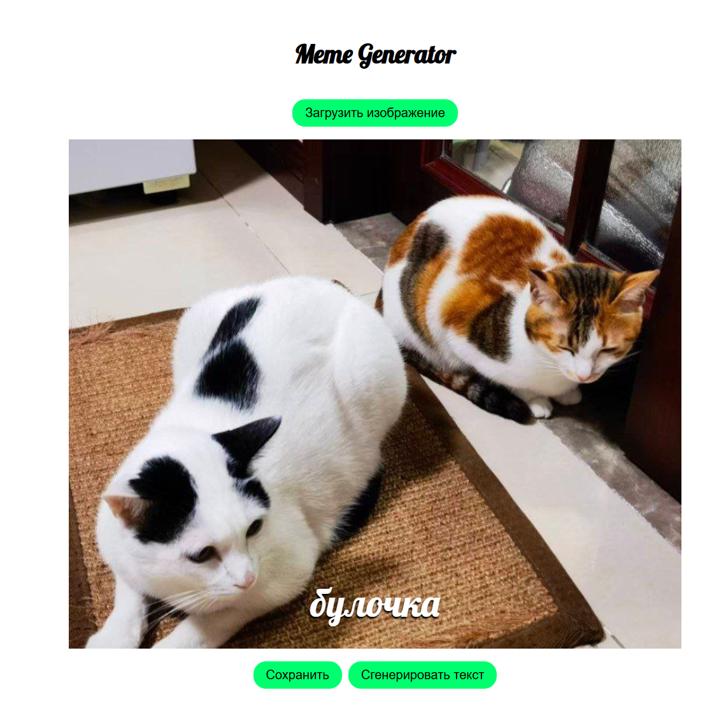
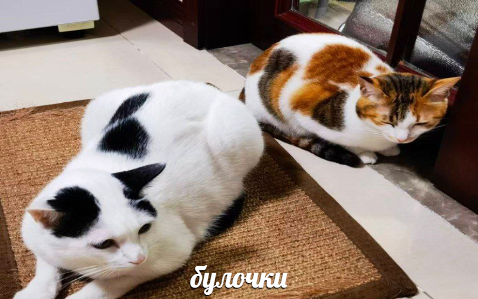

# Генератор мемов



Простое веб-приложение на React для создания мемов с пользовательским текстом.

## Требования

-   Node.JS v24

## Установка и запуск

1. Установите зависимости:

```
npm i
```

2. Запустите dev-сервер:

```
npm run dev
```

## Инструкция

1. Выбираем изображение, нажав кнопку "Загрузить изображение".
   
2. Вводим текст для мема в появившемся поле.
   
3. Нажимаем кнопку "Сохранить" и получаем готовый мем.
   
